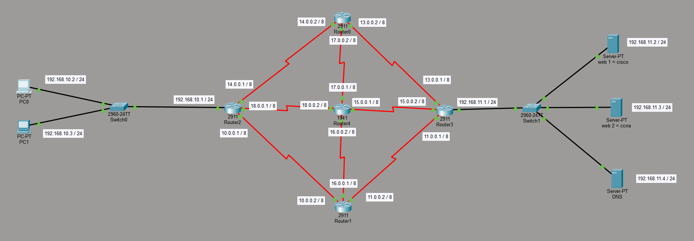
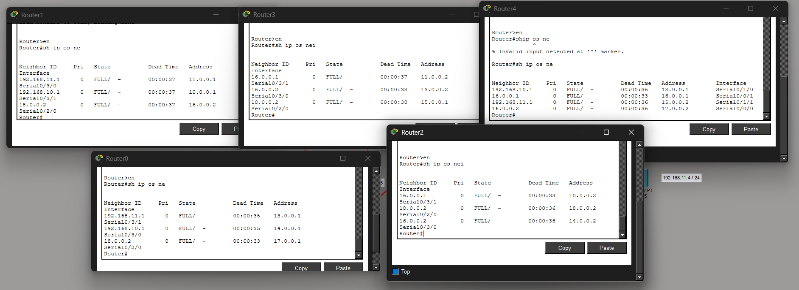
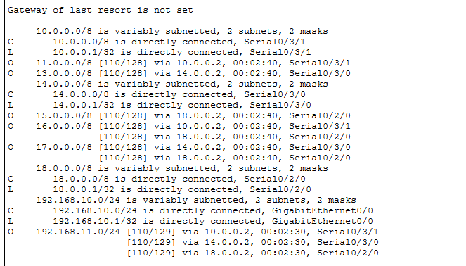
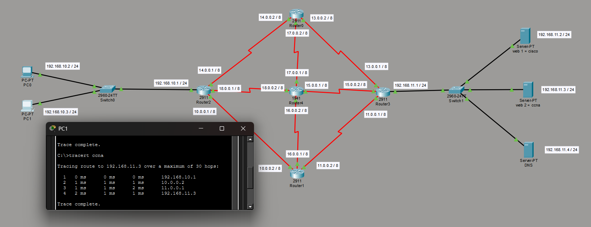
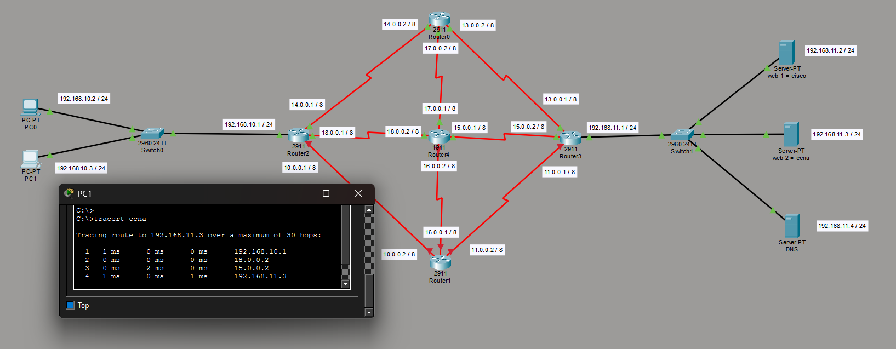
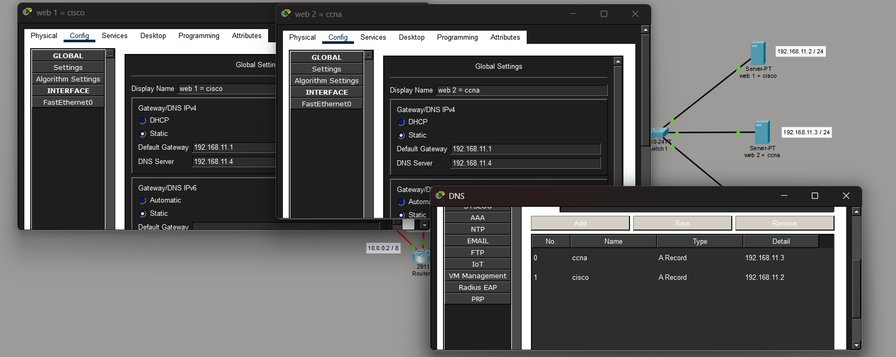

# OSPF Redundant Enterprise Network Design using Cisco Packet Tracer

## Project Overview
This project demonstrates the implementation of a fault-tolerant enterprise network using the Open Shortest Path First (OSPF) dynamic routing protocol in Cisco Packet Tracer. The network was designed with multiple routers, redundant routing paths, web servers, and a DNS server to simulate a real-world enterprise infrastructure.

The primary goal of this project was to ensure continuous communication between devices and servers even when a router failure occurs. OSPF dynamic routing was used to automatically recalculate routes and maintain connectivity without manual intervention.

---

# Project Objectives

- Design a scalable enterprise network topology
- Implement OSPF dynamic routing between routers
- Configure redundant network paths for fault tolerance
- Enable communication between client PCs and servers
- Simulate router failure and verify automatic rerouting
- Validate network connectivity using traceroute and routing verification

---

# Network Topology

The network consists of:

- 5 Cisco Routers
- 2 Cisco Switches
- Multiple PCs
- 2 Web Servers
- 1 DNS Server
- Redundant WAN Links
- OSPF Dynamic Routing

The topology was designed to provide multiple routing paths between networks to improve reliability and availability.

---

# IP Addressing Overview

## Left LAN
| Device | IP Address |
|---|---|
| PC0 | 192.168.10.2/24 |
| PC1 | 192.168.10.3/24 |
| Default Gateway | 192.168.10.1 |

---

## Server Network
| Device | IP Address |
|---|---|
| Router Gateway | 192.168.11.1/24 |
| Web Server 1 | 192.168.11.2/24 |
| Web Server 2 | 192.168.11.3/24 |
| DNS Server | 192.168.11.4/24 |

---

# OSPF Configuration

OSPF was configured across all routers to dynamically exchange routing information and automatically determine the best available paths.

## Features Implemented
- Dynamic route learning
- Automatic route recalculation
- Redundant routing paths
- Router neighbor discovery
- Network convergence during failures
- End-to-end communication between networks

---

# Fault Tolerance and Redundancy Test

To validate the reliability of the network, one router was intentionally powered off to simulate a real network failure.

## Result
Even after the router failure:
- Network communication remained operational
- PCs successfully accessed web servers
- OSPF dynamically selected an alternative routing path
- No manual route configuration was required

This demonstrates the self-healing and fault-tolerant capabilities of OSPF dynamic routing in enterprise environments.

---

# Project Screenshots

## 🔷 Full Network Topology


---

## 🔷 OSPF Neighbor Verification
OSPF neighbor relationships established successfully between routers.



---

## 🔷 OSPF Routing Table Verification
Routing tables dynamically learned through OSPF.



---

## 🔷 Normal Network Path Verification
Traceroute was performed from a client PC to verify the routing path selected by OSPF under normal conditions.



---

## 🔷 Router Failure and Automatic Rerouting
One router was intentionally powered off to simulate a network failure. OSPF automatically recalculated the routing path and maintained successful communication through an alternative route.



---

## 🔷 Server Configuration
Web servers and DNS server configuration within the enterprise network.



---

# Verification Commands Used

```bash
show ip route
show ip ospf neighbor
show ip protocols
tracert
ping
```

---

# Technologies Used

- Cisco Packet Tracer
- Cisco Routers
- Cisco Switches
- OSPF Routing Protocol
- Dynamic Routing
- DNS Services
- Web Servers
- TCP/IP Networking

---

# Key Learning Outcomes

This project provided practical experience in:

- OSPF Dynamic Routing
- Enterprise Network Design
- Fault-Tolerant Network Architecture
- Dynamic Route Convergence
- Network Redundancy
- Routing Table Analysis
- Network Troubleshooting
- Server Connectivity
- Traceroute Analysis

---

# Future Improvements

Possible future enhancements include:

- VLAN Segmentation
- DHCP Server Integration
- NAT Configuration
- Access Control Lists (ACLs)
- SSH Remote Router Management
- IPv6 Configuration
- Multi-Area OSPF Implementation

---

# Author

**Chandupa Silva**  
Network Engineering Student  
University of Colombo School of Computing (UCSC)

